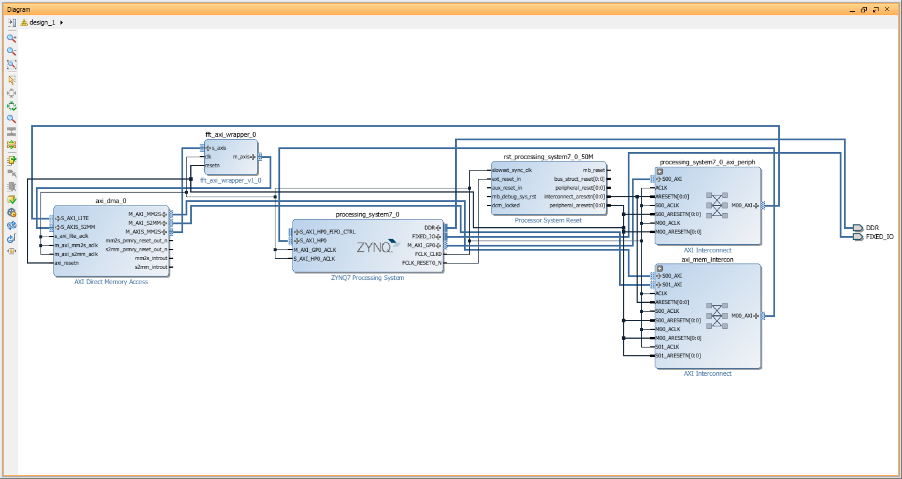
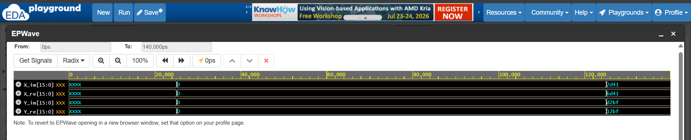
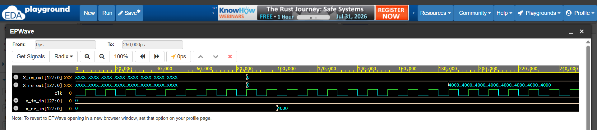
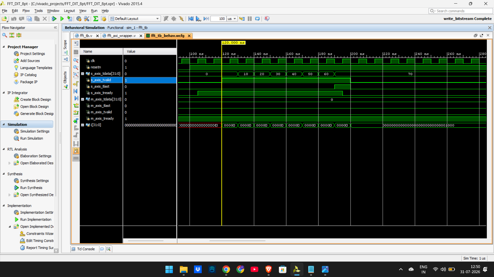
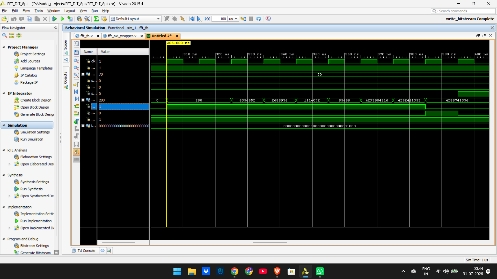
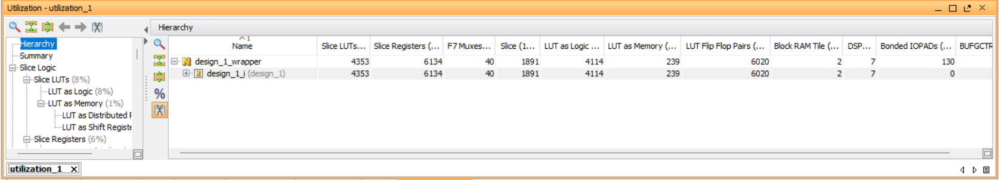
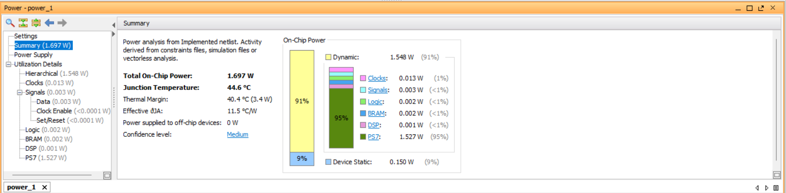
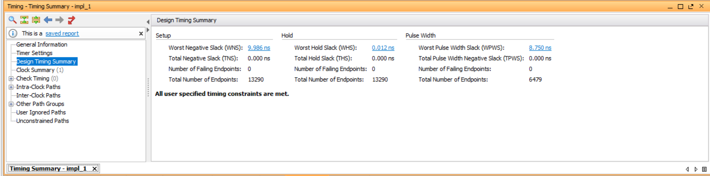

# FFT-AXI-Hardware-Accelerator
8-point DIT FFT hardware accelerator with an AXI4-Stream interface for Zynq-7000 SoCs
# Hardware Accelerator: 8-Point DIT FFT with AXI4-Stream Interface

## Overview
This repository contains the RTL design, hardware verification, and System-on-Chip (SoC) integration of an 8-point Decimation-In-Time (DIT) Fast Fourier Transform (FFT) accelerator. The custom IP is written in Verilog and wrapped in an AXI4-Stream interface for seamless integration with an ARM-based processing system via Direct Memory Access (DMA).

## 1. System Architecture (Block Design)
The hardware accelerator is integrated into a Zynq-7000 SoC environment. The design utilizes an AXI Direct Memory Access (DMA) block to handle high-speed memory-mapped to stream (MM2S) and stream to memory-mapped (S2MM) transfers between the Zynq ARM Cortex-A9 core and the custom FFT IP.

---

## 2. Hardware Verification (Simulation)
The design was rigorously verified using a bottom-up approach, starting from the core DSP arithmetic up to the system-level AXI protocol.

### 2.1 Core Math: Radix-2 Butterfly
Simulation of the fundamental `radix2_butterfly_pipelined` module, verifying the 3-stage pipelined complex multiplication and addition using fixed-point arithmetic.

### 2.2 Algorithm Integration: Top-Level FFT
Simulation of the `fft_8pt_top` module, verifying the data unpacking, twiddle factor integration, and the correct data flow through all three stages of the butterfly network.

### 2.3 System Integration: AXI4-Stream Wrapper
System-level simulation verifying the AMBA AXI4-Stream handshake protocols (`tvalid`, `tready`, `tlast`). This ensures the state machine correctly handles backpressure and prevents data loss during DMA transfers.

**AXI Stream Input (MM2S):**

**AXI Stream Output (S2MM):**

---

## 3. Synthesis & Implementation
The design was fully synthesized and implemented for the Xilinx Zynq-7000 (xc7z020) target device.

### 3.1 Resource Utilization
The custom IP is highly optimized for DSP operations, showcasing efficient mapping to the FPGA fabric.

### 3.2 Power Analysis
Estimated power consumption of the implemented hardware accelerator block.

### 3.3 Timing Analysis
The design successfully meets all timing constraints, achieving timing closure with positive Worst Negative Slack (WNS) and Total Negative Slack (TNS). This ensures reliable, synchronous operation across all pipeline stages at the target clock frequency.

---

## Tools & Technologies
* **Language:** Verilog, SystemVerilog
* **EDA Tool:** Xilinx Vivado 2015.4
* **Protocols:** AMBA AXI4-Stream, AXI-Lite
* **Target Device:** Zynq-7000 (xc7z020)
